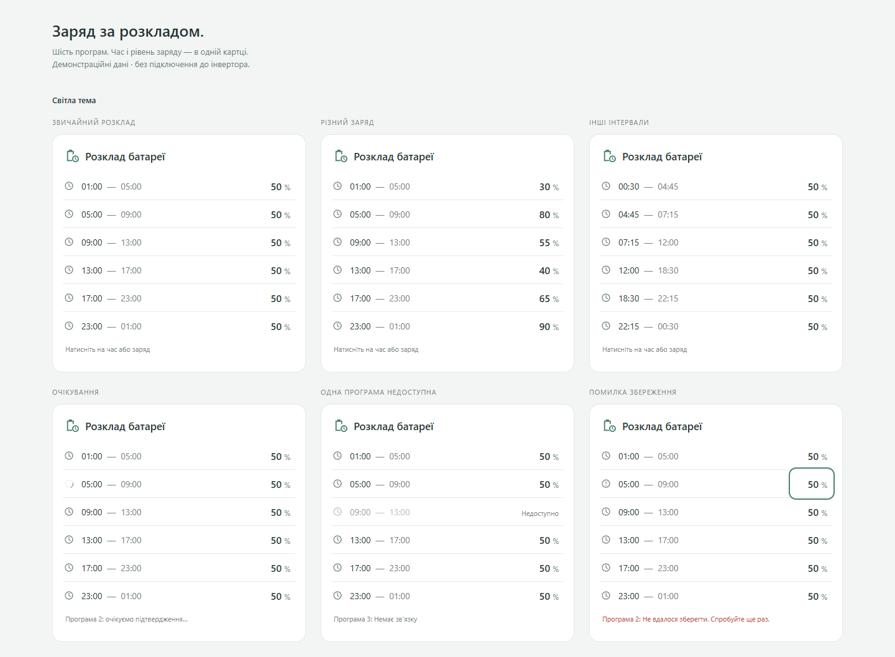
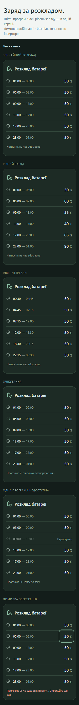

# Deye Battery Schedule Card

Compact Home Assistant dashboard card for editing Deye inverter Time of Use battery schedule.

One card, six compact rows, two editable values per program: start time and battery state of charge (SOC). Default card and visual-editor text is Ukrainian. This is an independent project; it can coexist with the Sonoff cards.

## Installation

### Manual

Build the bundle or download `deye-battery-schedule-card.js` from a published release. Copy it to `/config/www/deye-battery-schedule-card.js`. Add a dashboard resource with URL `/local/deye-battery-schedule-card.js` and type **JavaScript Module**, then reload the browser.

Select **Розклад батареї Deye** from the dashboard card picker. Configure the six time/SOC pairs in the visual editor or YAML. No entity names are guessed, including in the picker stub.

### HACS

The [latest release](https://github.com/Zoreslaw/deye-battery-schedule-card/releases/latest) includes the ready-to-install `deye-battery-schedule-card.js` bundle.

1. In HACS → **Custom repositories**, add `https://github.com/Zoreslaw/deye-battery-schedule-card` with category **Dashboard**.
2. Download **Deye Battery Schedule Card** and reload the browser.
3. If a resource was not created automatically, add `/hacsfiles/deye-battery-schedule-card/deye-battery-schedule-card.js` as a **JavaScript Module**.

Use either the manual resource or the HACS resource, not both. The release workflow builds and attaches the single self-contained JavaScript bundle to version tags matching `package.json`.

## Configuration

`programs` is required and contains exactly six ordered entries. Each entry needs a `time` entity ID in the `time.*` domain and a `soc` entity ID in the `number.*` domain. Entity IDs must be unique. `title` is optional; its default is `Розклад батареї`.

```yaml
type: custom:deye-battery-schedule-card
title: Розклад батареї
programs:
  - time: time.inverter_program_1_time
    soc: number.inverter_program_1_soc
  - time: time.inverter_program_2_time
    soc: number.inverter_program_2_soc
  - time: time.inverter_program_3_time
    soc: number.inverter_program_3_soc
  - time: time.inverter_program_4_time
    soc: number.inverter_program_4_soc
  - time: time.inverter_program_5_time
    soc: number.inverter_program_5_soc
  - time: time.inverter_program_6_time
    soc: number.inverter_program_6_soc
```

These example IDs were supplied for the user's Deye integration. Replace them with your own existing entities. See [examples/card.yaml](examples/card.yaml). The card does not create entities, enable Time of Use mode, or configure the inverter integration.

## Intervals and editing

Each row starts at its configured time entity and ends at the next program's time. Program 6 ends at Program 1 on the next day. Updating Program 2's start from 05:00 to 06:30 changes the end of Program 1 and start of Program 2 when Home Assistant confirms the value. Programs remain in configured inverter order; they are never silently sorted or renumbered. The card does not enforce inverter-specific ordering rules. Equal or out-of-order times are displayed as reported, so check that the configured order matches the device.

Tap the time interval to open a compact start-time dialog. An inline [Flatpickr](https://github.com/flatpickr/flatpickr) time picker provides separate 24-hour hour/minute fields with touch-sized plus/minus buttons and keyboard entry. It has no scrolling wheel or extra native popup, including on mobile. Nonzero seconds are displayed and preserved. Enter saves the typed time. Tap SOC for a compact minus/value/plus editor; direct numeric entry is also available there. Changes remain drafts until **Зберегти** or Enter; Cancel, Escape or tapping outside closes the dialog without sending a command.

SOC is limited to 0–100%, intersected with the entity's `min` and `max`; its `step` is respected. Missing numeric limits default to 0–100 with step 1. A non-percent unit or invalid attributes are treated as unavailable. If the entity value changes externally while a draft is open, saving is blocked until the editor is reopened with the current value.

## Confirmation and failures

The card uses [`time.set_value`](https://www.home-assistant.io/actions/time.set_value/) with `time: HH:MM:SS` and [`number.set_value`](https://www.home-assistant.io/actions/number.set_value/) with a numeric `value`. Only the selected entity is targeted.

`hass.states` remains authoritative. A fulfilled action promise does not confirm a new setting: the row keeps its previously confirmed value and a pending indicator until the exact target state arrives. Each program permits one outstanding command; other programs remain independently editable. Confirmation has a 15-second deadline, including stalled action promises. Failure, timeout and lost communication clear pending and show a short message. Timers, drafts and callbacks are invalidated on removal or reconfiguration.

A missing, invalid or unavailable entity disables only its own program. If a time entity is unavailable, the preceding program's end is shown as unknown; its own controls remain usable. The footer reports the most recent error or first pending/unavailable program. Every row also has an accessible description.

## Layout and accessibility

One `ha-card`, no nested cards or timeline. Rows have 44-pixel touch targets, visible focus and native keyboard activation. Dialogs trap focus and return it to the triggering control. Escape cancels editing. The footer reserves space so pending/error messages do not move rows. Motion is limited to the pending spinner, disabled under `prefers-reduced-motion`.

The card uses Home Assistant theme variables. Content stays within 460 pixels even in a wide section; mobile keeps all six rows without horizontal scrolling. `getGridOptions()` requests full section width and automatic row height, following [Home Assistant's custom card sizing API](https://developers.home-assistant.io/docs/frontend/custom-ui/custom-card/). Manual `grid_options` is unnecessary.

## Development and preview

Use Node.js 22.13 or newer.

```sh
npm install
npm run build
npm test
npm run test:browser
npm start
```

Open `http://localhost:5001/examples/preview.html`. The standalone preview uses mock entities and never connects to Home Assistant. It shows normal, varied SOC, alternate intervals, pending, unavailable and failed commands, in both themes. Query filters: `?theme=dark&scenario=normal`. Pending examples demonstrate the real 15-second timeout; reload to restart them.

Browser tests use Microsoft Edge on Windows. On Linux/macOS run `npx playwright install chromium` first. Tests start their own preview server when needed and write screenshots to `previews/`. Unit tests cover model calculation, exact service targets, confirmation, duplicate suppression, timeout, errors, row isolation, editor configuration and lifecycle cleanup. Browser tests cover keyboard, touch/scroll, focus, themes, overflow, stable layout and reduced motion.




The implementation has been verified against simulated Home Assistant state and service behavior. A live Deye inverter has not been used for validation.

## Architecture and scope

- `src/model.ts`: configuration, time normalization, intervals and SOC constraints.
- `src/commands.ts`: independent per-program command lifecycle and confirmation.
- `src/deye-battery-schedule-card.ts`: compact rows and draft dialogs.
- `src/editor.ts`: six-pair visual configuration editor.

Only time and SOC are implemented. Power limits, charging source and other parameters can be added later without changing the six-program mapping. No direct device API, backend or Sonoff switching logic is included.

## License

MIT; see [LICENSE](LICENSE). The original technical scaffold's copyright notice is preserved.

Flatpickr is bundled under the MIT license; its copyright and license text are included in the distributed JavaScript file.
